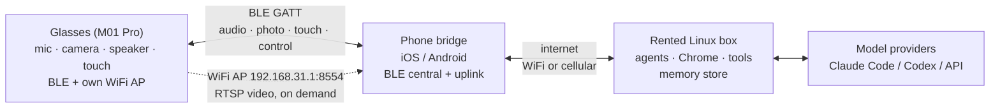
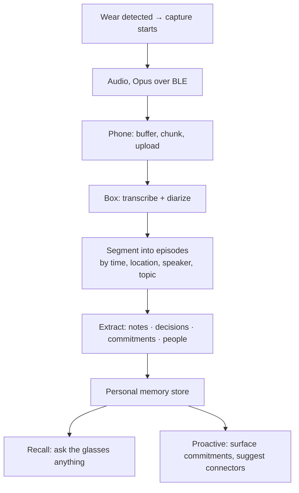

# UU Lab glasses — system architecture

*Last updated: 2026-08-08. Supersedes AGENT-BRIEF §8-B/C/D, which described these
as three separate side businesses. They are one product.*

---

## 1. The product

$249 glasses plus a subscription for a rented always-on Linux box running the
user's agent sessions (Claude Code, Codex, OpenCode, Hermes) with a full browser
and toolchain.

Four things the glasses do:

1. **Control** — drive long-lived agent sessions by voice from anywhere
2. **Recall** — ask what you were working on, at any time
3. **Capture** — passively record the day, transcribe it, extract notes and commitments into a personal memory
4. **Expand** — connectors (GitHub, calendar, etc.) that the system proactively suggests as it learns what you do

Hardware is the wedge, the subscription is the business, and the SDK is
open-sourced so people customize it — which is also the distribution channel.
Pricing and margin live in `PRODUCT.md`.

**What compounds:** the memory. Hours 1–100 of your captured working life make
hour 101 more useful. No Ray-Ban does this, and a competitor cannot copy a user's
accumulated context.

---

## 2. Topology, and why the phone is not optional

**The glasses have no internet path of their own.** Their entire connectivity
surface is BLE GATT, classic Bluetooth SPP, their own WiFi access point, and
WiFi P2P. There is no command to join an access point — verified across all 109
pages of 通信协议 v2.0.17: the only WiFi configuration commands are `0x0901`
设置 WIFI SSID and `0x0902` 设置 WIFI 密码, both deprecated, and both configuring
the device's *own* hotspot (设置热点). `0x090B` opens and closes that AP.

Therefore the rented box can never reach the glasses directly, and **the phone
app is the spine of the product, not an accessory.** It cannot ship later.

This resolves the open question in AGENT-BRIEF §8-D ("verify this, it decides two
weeks of work"). It is decided.

### 2.1 The two radio paths

| Path | Carries | Cost |
|---|---|---|
| **BLE** (default, always on) | mic audio, photos, touch events, speaker routing, all control | low power; ~2–5 KB/s practical |
| **WiFi AP** (on demand) | RTSP video preview at `192.168.31.1:8554` | phone must *join the glasses' network*, losing its WiFi uplink |

The second one has a consequence worth designing around: while streaming video,
the phone reaches the internet **only over cellular**, because its WiFi radio is
occupied by the glasses. Video sessions are therefore explicitly user-initiated
and time-boxed, never background.

Everything in the core product loop rides BLE. Video is a feature, not a
foundation.

---

## 3. Components

### 3.1 Glasses — M01 Pro

Capabilities confirmed from the shipping iOS SDK headers and the protocol spec:

| Function | Mechanism |
|---|---|
| Microphone | Opus and PCM, 16 kHz mono (`0x0A03` 音频数据) |
| On-device ASR | device returns recognized text directly (`didReceiveAIChatTextMessage`) |
| Photo | `0x0906`/`0x0907`, delivered **chunked over BLE** — no WiFi needed |
| Speaker | output routing to glasses vs phone (`setSpeakerPlaybackStatus`) |
| Touch | tap ×1/2/3, long press, swipe fwd/back (`QCDeviceTouchAction`) |
| Wear detection | wear / remove events — free session gating |
| Wake word | `0x0F01`–`0x0F03` |
| Video | RTSP over the device's own AP |
| Clock sync | `0x0903` 设置时间 |
| Capability query | `0x0005` 获取支持功能 — **call before anything else** |

Wear detection is the cheapest useful signal in the whole system: capture starts
when the glasses go on and stops when they come off, with no user action.

### 3.2 Phone bridge

Responsibilities, in order of importance:

1. BLE central — connection, MTU negotiation, notify subscription, reconnect
2. Frame codec — already built (`glasses/protocol/`)
3. Buffer and forward audio upstream; play responses downstream
4. Survive backgrounding — the hard part on iOS
5. Hold the capture consent state and the recording indicator
6. Store-and-forward when the box is unreachable (subway, plane)

iOS specifics to read out of Mentra's client, which is shipping and approved
(AGENT-BRIEF §8-B): `UIBackgroundModes`, `CBCentralManager` state restoration,
and `AVAudioSession` category setup. State restoration is what lets iOS relaunch
the app into the background when the glasses reconnect.

**The phone pays for all-day capture too** — continuous BLE plus uplink is a real
drain on the user's phone battery and data, not only on the glasses.

### 3.3 Rented box — Linux

Not a bare VPS. It is a browser-automation and development host:

- **Chrome/Chromium headless** plus a display server for anything that needs one
- Full toolchain: git, node, python, ripgrep, build tools
- The agent runtimes themselves: Claude Code, Codex, OpenCode, Hermes
- Persistent home directory — the agent's working state and the user's memory
- Per-user isolation (container or VM), because agents execute arbitrary code

Sizing: agents plus Chrome want **8–16 GB RAM**; Chrome alone will take 1–2 GB
under load, which is most of why the entry tier is 8 GB rather than 4. Renting
Mac hardware costs several times a Linux box of the same size while running the
same agents, which is why §8-D ruled it out. Costs and tier pricing are in
`CLOUD.md`.

A macOS tier stays viable later as an upsell for users who need Xcode, priced to
cover its real cost.

### 3.4 Model access

Three modes, decreasing operational burden:

1. **BYO subscription** — Claude Code with the user's Claude account, or Codex.
   Cleanest economically; the friction is that OAuth login on a headless remote
   box is awkward, so the onboarding flow needs to handle it explicitly.
2. **BYO API key** — user pastes a key; you store and scope it.
3. **Your token plan** — you resell inference. Simplest for the user, and the
   only mode where inference cost lands on your P&L.

---

## 4. The capture pipeline

This is the part that compounds, so it gets its own section.

Design decisions worth stating up front:

- **Transcribe on the box, not the phone.** Keeps the phone thin, keeps the model
  swappable, and the audio has to go up anyway.
- **Keep the transcript, not the audio.** Storing raw audio of the user's whole
  life is a liability with no proportional benefit. Retain audio only briefly for
  re-transcription, then discard by default.
- **Episodes, not one endless log.** Retrieval quality depends on segmentation.
- **Commitments are the killer output.** "You told Marc you'd send the BOM by
  Friday" is worth more than a searchable transcript, and it is what makes the
  memory feel alive rather than archival.

### 4.1 Memory and recall

The memory serves two different reads and they want different shapes:

| Read | Latency budget | Shape |
|---|---|---|
| "What did I decide about the CRC?" | conversational, < 2 s to first audio | semantic search over episodes |
| "What did I commit to this week?" | can be slower | structured records with dates and people |

So: embeddings over episode text for recall, plus an extracted structured layer
(commitments, people, decisions) for the proactive side. Same pipeline, two
outputs.

### 4.2 Connectors

Connectors are MCP servers on the box. The suggestion loop is: the extraction
step already names tools and services the user talks about, so when GitHub shows
up repeatedly and isn't connected, the system offers it. That is a real use of
the capture data, and it makes the product get better the longer it runs.

---

## 5. Budgets

### 5.1 Latency — voice round trip

| Hop | Estimate |
|---|---|
| Speech → glasses ASR or audio out over BLE | 100–300 ms |
| Phone → box (WiFi or LTE) | 30–100 ms |
| Agent turn | 1–10 s, task dependent |
| Response → glasses speaker | 100–300 ms |

Conversational floor is roughly **0.5 s**; the agent dominates everything after.
That argues for streaming responses to the speaker as they generate, and for a
short local acknowledgement ("working on it") so the user isn't left in silence.

### 5.2 Bandwidth — the `look()` tradeoff

Opus at 16 kHz mono is ~16–24 kbps ≈ 2–3 KB/s, which fits comfortably in BLE.
**Photos do not.** At practical BLE throughput a 100 KB JPEG takes on the order
of 20+ seconds — far too slow for a vision call in conversation.

Two mitigations, both already in the SDK:

- `setAIImageClarity(width, height)` — send small images. A 320×240 frame is
  usually enough for "what am I looking at", and lands in a couple of seconds.
- Escalate to the WiFi AP path when the user explicitly wants a high-resolution
  capture, accepting the cellular-only tradeoff from §2.1.

**Resolution is a latency dial, and BLE throughput sets it.** This should be a
tunable, not a constant.

But the dial only applies to photos someone is *waiting on*. Most photos are not:

| Job | Path | Cost |
|---|---|---|
| Passive/timeline capture | shutter to device storage, full resolution | free — rides the nightly WiFi sync with the audio |
| Browse what was captured | thumbnail over BLE, clarity 0–6 | ~1–5 s |
| Agent answering "what is this?" | capture + deliver over BLE, small | ~2 s at 320×240 |
| Full-resolution retrieval | over the access point | seconds |

The vendor SDK already exposes a thumbnail path with a clarity scale its own docs
describe as "the higher the number, the clearer the image, but the slower the
transmission speed" — the latency dial is in the hardware, not something we
invented.

Reaching for immediate BLE delivery by default is the mistake: it spends tens of
seconds transferring an image that could have ridden the nightly sync at full
resolution for nothing. Photos split exactly the way audio does.

### 5.3 The daily sync — why it rides WiFi, not BLE

The glasses hold **4 GB**, which is 2–23 days of audio depending on the on-device
format (see `APPS-SCOPE.md` §3.1). Storage is not the constraint. Moving it is.

A single 16-hour day is ~173 MB as Opus, ~1.84 GB as PCM. Over BLE at a practical
~3 KB/s that is **16 hours to a week** — the sync would never finish. Over the
glasses' WiFi AP at ~2 MB/s it is 90 seconds to 15 minutes.

So passive capture syncs over WiFi, in two phases, because §2.1 means the phone
cannot hold the glasses' AP and its own uplink simultaneously:

1. Phone joins the glasses' AP → pulls the day's files → releases it
2. Phone rejoins normal WiFi → uploads to the box

Natural trigger is charging: both devices are stationary and the user is asleep.
This makes the sync a **designed ritual rather than a background trickle**, which
is also better for battery on both ends.

### 5.4 Power

The glasses **can be used while plugged in**, which covers the desk hours that
make up most of a developer's capture-worthy day. Unplugged runtime is still
unmeasured and bounds mobile capture — see §7.

---

## 6. Privacy, consent, and the recording indicator

Always-on capture is a product constraint, not a footnote.

- **Two-party consent** jurisdictions include Quebec, California, Illinois,
  Washington, Pennsylvania, Massachusetts and Florida. Recording a conversation
  without all parties' consent is a legal problem in the user's home market.
- **Illinois BIPA** attaches if faces are processed.
- Meta ships a **hardware capture LED** on Ray-Bans for exactly this reason.
  Whether the M01 Pro has one, and whether it can be driven from the protocol, is
  an open hardware question (§7).

Architectural implications:

- Bystander-visible recording indication is a requirement, ideally hardware
- Capture defaults to off in a new location or with new voices present, until confirmed
- Transcripts are the user's data, encrypted at rest, exportable and deletable
- Per-user isolation on the box is a privacy boundary, not just a security one

---

## 7. Open questions that gate the build

| Question | Why it matters | How to answer |
|---|---|---|
| **Unplugged battery while recording locally** | bounds the *mobile* capture window; desk use is covered by charging (§5.4) | measure on hardware |
| **On-device recording format (Opus vs PCM)** | changes storage headroom and sync duration by ~10× | one capture, then check file size and header |
| **Thermals while recording plugged in** | the rejected sibling class warned against record-while-charging; this sits at the temple | run it for several hours and feel it |
| **Hardware recording indicator** | legal and social viability of passive capture | inspect a unit; check protocol for LED control |
| **FCC ID** | required to resell in the US | confirm with supplier (already flagged in §8-B) |
| **Real BLE throughput** | sets the `look()` resolution dial | measure MTU and sustained rate |
| **iOS background survival** | if the app is killed, capture silently stops | prototype against Mentra's approved patterns |
| **Headless OAuth for BYO subscriptions** | onboarding friction on every single user | prototype the login flow early |

The first two need hardware, which is in Quebec. Everything else can start now.

---

## 8. Build order

1. ~~**Protocol codec**~~ — done: `glasses/protocol/`, 92 tests
2. **Transport** — bleak client, request/response matching on sequence number,
   heartbeat `0x0007`, capability gating on `0x0005`. Buildable against a mock.
3. **Box image** — Linux + Chrome + toolchain + agent runtimes, reproducible
4. **Phone bridge** — the long pole; start it as soon as transport works
5. **Capture pipeline** — transcribe → episode → extract → memory
6. **Recall + proactive surface** — the part users will actually describe to friends
7. **Connector suggestions** — needs capture data to be useful, so it comes last

Steps 2 and 3 are independent and can run in parallel.

---

## 9. What is verified vs assumed

Everything in §2 about connectivity is verified against the protocol spec and the
shipping SDK — see `glasses/NOTES.md` for the evidence, including the CRC-16
variant that the spec's own appendix gets wrong.

Bandwidth, latency and power figures in §5 are **estimates from published
characteristics of BLE and Opus, not measurements of this device.** They are
directionally reliable enough to design against and should be replaced with real
numbers as soon as hardware is in hand.
