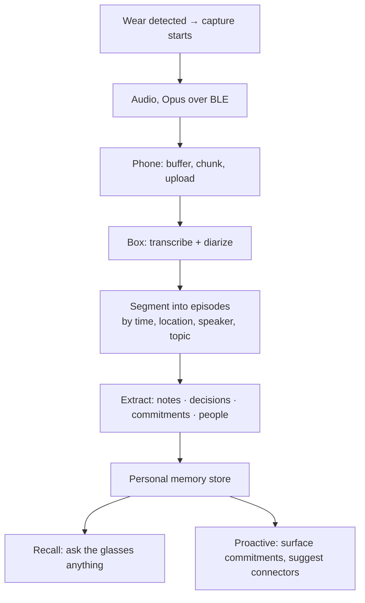

# UU Lab glasses — system architecture

*Last updated: 2026-08-13. Supersedes AGENT-BRIEF §8-B/C/D, which described these
as three separate side businesses. They are one product.*

*The 2026-08-13 pass touches §3.3, §7 and §8 only, and all three for the same
reason: OpenClaw's Gateway became the session bus (`ORCHESTRATOR.md` §3a), which
puts a second always-on daemon and a Node version floor on the box.*

---

## 1. The product

$249 glasses plus a subscription for an always-on Mac mini of ours running the
user's agent sessions — Claude Code, OpenClaw, Hermes, Codex, OpenCode, and
through OpenClaw's Gateway the dozen-odd harnesses we would never have written
an adapter for — with a full browser and toolchain.

Four things the glasses do:

1. **Control** — drive long-lived agent sessions by voice from anywhere
2. **Recall** — ask what you were working on, at any time
3. **Capture** — passively record the day, transcribe it, extract notes and commitments into a personal memory
4. **Expand** — connectors (GitHub, calendar, etc.) that the system proactively suggests as it learns what you do

Hardware is the wedge, the subscription is the business, and the SDK is
open-sourced so people customize it — which is also the distribution channel.
Pricing and margin live in `PRODUCT.md`.

**What compounds:** the memory. Hours 1–100 of your captured working life make
hour 101 more useful. No Ray-Ban does this, and a competitor cannot copy a user's
accumulated context.

---

## 2. Topology, and why the phone is not optional

**The glasses have no internet path of their own.** Their entire connectivity
surface is BLE GATT, classic Bluetooth SPP, their own WiFi access point, and
WiFi P2P. There is no command to join an access point — verified across all 109
pages of 通信协议 v2.0.17: the only WiFi configuration commands are `0x0901`
设置 WIFI SSID and `0x0902` 设置 WIFI 密码, both deprecated, and both configuring
the device's *own* hotspot (设置热点). `0x090B` opens and closes that AP.

Therefore the box can never reach the glasses directly, and **the phone app is
the spine of the product, not an accessory.** It cannot ship later.

This resolves the open question in AGENT-BRIEF §8-D ("verify this, it decides two
weeks of work"). It is decided.

### 2.1 The two radio paths

| Path | Carries | Cost |
|---|---|---|
| **BLE** (default, always on) | mic audio, photos, touch events, speaker routing, all control | low power; ~2–5 KB/s practical |
| **WiFi AP** (on demand) | RTSP video preview at `192.168.31.1:8554` | phone must *join the glasses' network*, losing its WiFi uplink |

The second one has a consequence worth designing around: while streaming video,
the phone reaches the internet **only over cellular**, because its WiFi radio is
occupied by the glasses. Video sessions are therefore explicitly user-initiated
and time-boxed, never background.

Everything in the core product loop rides BLE. Video is a feature, not a
foundation.

---

## 3. Components

### 3.1 Glasses — M01 Pro

Capabilities confirmed from the shipping iOS SDK headers and the protocol spec:

| Function | Mechanism |
|---|---|
| Microphone | Opus and PCM, 16 kHz mono (`0x0A03` 音频数据) |
| Speech recognition | **none on device.** It reports an event and the app recognises — `didReceiveAIChatTextMessage` is the *vendor's* cloud assistant, not ours to inherit. See `SYSTEM.md` §7b |
| Photo | `0x0906`/`0x0907`, delivered **chunked over BLE** — no WiFi needed |
| Speaker | output routing to glasses vs phone (`setSpeakerPlaybackStatus`) |
| Touch | tap ×1/2/3, long press, swipe fwd/back (`QCDeviceTouchAction`) |
| Wear detection | wear / remove events — free session gating |
| Wake word | `0x0F01`–`0x0F03` |
| Video | RTSP over the device's own AP |
| Clock sync | `0x0903` 设置时间 |
| Capability query | `0x0005` 获取支持功能 — **call before anything else** |

Wear detection is the cheapest useful signal in the whole system: capture starts
when the glasses go on and stops when they come off, with no user action.

### 3.2 Phone bridge

Responsibilities, in order of importance:

1. BLE central — connection, MTU negotiation, notify subscription, reconnect
2. Frame codec — already built (`glasses/protocol/`)
3. Buffer and forward audio upstream; play responses downstream
4. Survive backgrounding — the hard part on iOS
5. Hold the capture consent state and the recording indicator
6. Store-and-forward when the box is unreachable (subway, plane)

iOS specifics to read out of Mentra's client, which is shipping and approved
(AGENT-BRIEF §8-B): `UIBackgroundModes`, `CBCentralManager` state restoration,
and `AVAudioSession` category setup. State restoration is what lets iOS relaunch
the app into the background when the glasses reconnect.

**The phone pays for all-day capture too** — continuous BLE plus uplink is a real
drain on the user's phone battery and data, not only on the glasses.

### 3.3 The always-on machine

Not a bare VPS. It is a browser-automation and development host:

- **Chrome/Chromium headless** plus a display server for anything that needs one
- Full toolchain: git, node, python, ripgrep, build tools
- The agent runtimes themselves: Claude Code, OpenClaw, Hermes, Codex, OpenCode
- **The OpenClaw Gateway, as a second always-on daemon** — see below
- Persistent home directory — the agent's working state and the user's memory
- Per-user isolation (container or VM), because agents execute arbitrary code

Sizing: agents plus Chrome want **8–16 GB RAM**; Chrome alone takes 1–2 GB under
load. The boxes are **Mac minis we own**, one per customer, which is what makes
"close your laptop and it keeps going" true today. Linux is the likely move once
customer count makes single-tenant hardware uneconomic — see `CLOUD.md` §5.

**The box now runs two daemons, decided 2026-08-13** (`ORCHESTRATOR.md` §3a).
relayd is still one static binary with nothing to install, and that is the
`curl | sh` promise; the Gateway is a Node process that OpenClaw's own installer
registers with launchd or systemd. Four consequences land on this section rather
than on the orchestrator's, because they are properties of the machine:

- **`node` becomes a box requirement**, inside a narrow range —
  `>=22.22.3 <23 || >=24.15.0 <25 || >=25.9.0`. A stock machine plausibly fails
  it: this one's default `v25.8.0` satisfies none of the three, so the version
  has to be a checked fact and not an assumption. It is also why the bus is
  opt-in and why a box that declines it still works.
- **Two supervisors, one box, no ordering between them.** Both units are
  start-at-boot with restart-on-exit and neither waits for the other, so relayd
  must treat "the Gateway is not answering yet" as an ordinary state with
  backoff, not an error at startup — and the handshake must not sit in front of
  the listener, or a reboot means a minute where the glasses cannot reach the box
  *and* the health page that would explain it is behind the same listener.
- **Whoever owns the Gateway process owns it exclusively.** OpenClaw resolves
  the daemon's node binary, bakes a PATH into a 0600 env file, and moves the
  entrypoint on upgrade; two supervisors on one port is a crash loop. So Relay
  owns the *contract* — registered, loaded, live, ready, at the pinned version —
  and never runs `gateway run` itself.
- **A LaunchAgent needs a logged-in GUI session.** An always-on headless Mac
  mini therefore needs auto-login, or both daemons look correctly installed to
  every check that reads the filesystem and neither is running. This is the
  macOS twin of the systemd lingering trap, and it applies to the machine this
  product is actually installed on.

### 3.4 Model access

Three modes, decreasing operational burden:

1. **BYO subscription** — Claude Code with the user's Claude account, or Codex.
   Cleanest economically; the friction is that OAuth login on a headless remote
   box is awkward, so the onboarding flow needs to handle it explicitly.
2. **BYO API key** — user pastes a key; you store and scope it.
3. **Your token plan** — you resell inference. Simplest for the user, and the
   only mode where inference cost lands on your P&L.

---

## 4. The capture pipeline

This is the part that compounds, so it gets its own section.

Design decisions worth stating up front:

- **Transcribe on the box, not the phone.** Keeps the phone thin, keeps the model
  swappable, and the audio has to go up anyway.
- **Keep the transcript, not the audio.** Storing raw audio of the user's whole
  life is a liability with no proportional benefit. Retain audio only briefly for
  re-transcription, then discard by default.
- **Episodes, not one endless log.** Retrieval quality depends on segmentation.
- **Commitments are the killer output.** "You told Marc you'd send the BOM by
  Friday" is worth more than a searchable transcript, and it is what makes the
  memory feel alive rather than archival.

### 4.1 Memory and recall

The memory serves two different reads and they want different shapes:

| Read | Latency budget | Shape |
|---|---|---|
| "What did I decide about the CRC?" | conversational, < 2 s to first audio | semantic search over episodes |
| "What did I commit to this week?" | can be slower | structured records with dates and people |

So: embeddings over episode text for recall, plus an extracted structured layer
(commitments, people, decisions) for the proactive side. Same pipeline, two
outputs.

### 4.2 Connectors

Connectors are MCP servers on the box. The suggestion loop is: the extraction
step already names tools and services the user talks about, so when GitHub shows
up repeatedly and isn't connected, the system offers it. That is a real use of
the capture data, and it makes the product get better the longer it runs.

---

## 5. Budgets

### 5.1 Latency — voice round trip

| Hop | Estimate |
|---|---|
| Speech → glasses ASR or audio out over BLE | 100–300 ms |
| Phone → box (WiFi or LTE) | 30–100 ms |
| Agent turn | 1–10 s, task dependent |
| Response → glasses speaker | 100–300 ms |

Conversational floor is roughly **0.5 s**; the agent dominates everything after.
That argues for streaming responses to the speaker as they generate, and for a
short local acknowledgement ("working on it") so the user isn't left in silence.

### 5.2 Bandwidth — the `look()` tradeoff

Opus at 16 kHz mono is ~16–24 kbps ≈ 2–3 KB/s, which fits comfortably in BLE.
**Photos do not.** At practical BLE throughput a 100 KB JPEG takes on the order
of 20+ seconds — far too slow for a vision call in conversation.

Two mitigations, both already in the SDK:

- `setAIImageClarity(width, height)` — send small images. A 320×240 frame is
  usually enough for "what am I looking at", and lands in a couple of seconds.
- Escalate to the WiFi AP path when the user explicitly wants a high-resolution
  capture, accepting the cellular-only tradeoff from §2.1.

**Resolution is a latency dial, and BLE throughput sets it.** This should be a
tunable, not a constant.

But the dial only applies to photos someone is *waiting on*. Most photos are not:

| Job | Path | Cost |
|---|---|---|
| Passive/timeline capture | shutter to device storage, full resolution | free — rides the nightly WiFi sync with the audio |
| Browse what was captured | thumbnail over BLE, clarity 0–6 | ~1–5 s |
| Agent answering "what is this?" | capture + deliver over BLE, small | ~2 s at 320×240 |
| Full-resolution retrieval | over the access point | seconds |

The vendor SDK already exposes a thumbnail path with a clarity scale its own docs
describe as "the higher the number, the clearer the image, but the slower the
transmission speed" — the latency dial is in the hardware, not something we
invented.

Reaching for immediate BLE delivery by default is the mistake: it spends tens of
seconds transferring an image that could have ridden the nightly sync at full
resolution for nothing. Photos split exactly the way audio does.

### 5.2b Voice — wake words and speech

**Wake words are firmware, not software.** `0x0F01` 获取语音唤醒功能列表 returns a
list the firmware was built with — `Index, Type, Len, Value`, where Type 0 is an
AI wake phrase, 1 a Bluetooth control, 2 a device control. `0x0F02`/`0x0F03` read
and set which entries are active. There is no command that accepts a new phrase,
because the spotter is a trained model running on the device's DSP.

The spec's own worked example lists the AI wake phrase as **`"hey chatgpt"`**.
Assume stock units ship with that until measured.

So a per-user custom phrase ("Hey Jarvis") has three possible routes, and only
one of them is free:

| Route | Gives | Costs |
|---|---|---|
| **Tap to talk** | works today, zero battery, zero latency | not hands-free |
| Supplier firmware build | one branded phrase on every unit | money, lead time, an MOQ, and still not per-user |
| Phone-side spotter | genuinely per-user phrases | the mic stream must stay open, which is the continuous-BLE cost §5.3 exists to avoid |

**Decision, 2026-08-11: hands-free is a requirement, not a nice-to-have.** An
earlier revision of this section recommended tap-to-talk as the primary trigger
and treated naming as a substitute for it. That was wrong about the product: a
trigger you can only reach with a free hand fails in the exact moments the
glasses exist for — driving, carrying something, mid-meeting, hands in a project.

Note what the firmware ceiling actually covers. It blocks *a custom phrase in the
device's DSP*. It does not block hands-free, because `0x0A02`/`0x0A03` already
carry the mic to the phone and the bridge already implements the uplink
(`startMicUplink` / `audioChunk`). Route 3 was always the one that matches the
product; it was priced as expensive and then dropped without measuring.

So: **phone-side spotter, gated by power state.**

| State | Trigger | Why |
|---|---|---|
| Plugged in | wake phrase, always listening | §5.4 — charging covers most desk hours at zero battery cost |
| Unplugged, above threshold | wake phrase | the cost is real but bounded; the threshold is a user setting |
| Unplugged, below threshold | tap only, and say so in the app | degrade honestly rather than dying silently |

Two things make this fit the channel. First, `0x0A03` is **bidirectional and
shares one ~3 KB/s budget** (`commands.ts`), so a full-rate 24 kbps uplink
saturates it and starves the reply — the wake stream must run lower. Second, a
spotter does not need capture quality: 16 kHz mono at 8–16 kbps is ~1–2 KB/s and
leaves headroom. Whether `0x0A02` exposes bitrate or format control is unverified
and is now a §7 question.

Independently, on the first supplier order: ask for a **neutral wake phrase** in
the keyword table, not just the removal of `"hey chatgpt"`. That buys a zero-power
hardware trigger for the default phrase. Per-user names still ride the phone-side
spotter — one is the cheap path, the other is the general one, and they compose.

Naming the assistant remains worth doing. It is no longer the *answer* to
hands-free.

**Text to speech is ours to choose and is not chosen yet.** The return path is
easy — the glasses are a normal Bluetooth audio sink (they do music and calls),
and `setSpeakerPlaybackStatus` routes output to them — so TTS audio goes
cloud → phone → A2DP → speaker with no protocol work.

What matters is **time to first audio**, not quality. Past roughly 300 ms a voice
assistant feels dead, and no amount of naturalness recovers it. So: streaming
only, and a provider slot rather than a hardcoded vendor, matching how the model
is already BYO. Candidates worth benchmarking on the real path — Cartesia Sonic,
ElevenLabs Flash, Deepgram Aura, OpenAI's mini TTS — with the phone's native
synthesiser (`AVSpeechSynthesizer` / Android `TextToSpeech`) as the offline
fallback, since it is free, instant and always available.

*Do not take published latency numbers on faith.* Measure round trip on this
device, over A2DP, from the box — that path has more hops than a vendor's demo.

Speech **in** is not free, contrary to an earlier note here. The device has no
recogniser: `0x0803`/`0x0805` show it reporting an event while the *app* starts
and stops recognition, and `didReceiveAIChatTextMessage` is the vendor's own
cloud assistant. ASR is ours to run, on the phone or in the cloud. See
`SYSTEM.md` §7b.

### 5.2c Can we update the firmware?

**Flash it: yes, fully. Author it: no.**

Everything needed to push a firmware image is documented and implemented. The
protocol carries `0x0B01`–`0x0B04` (OTA info, version report, start, complete),
and the iOS SDK exposes a complete DFU state machine — `switchToDFU`,
`initDFUFirmwareType`, `sendFilePacketData`, `checkMyFirmwareWithData`,
`finishDFU`, plus `startToBleOTAFirmwareUpdateWithFilePath` and a WiFi variant.
`QG_DFU_Operation` enumerates the whole opcode set. The SDK even ships a real
image to practise on: `Resource/A02Q8DP_2.00.04_260415.bin`.

That image is also where the ceiling shows up. Its layout:

| Offset | Contents |
|---|---|
| `0x00` | magic `e5c3bd81` |
| `0x04` | payload length, `1008973` (file is 1009053 — an 80-byte header) |
| `0x0C` | checksum |
| `0x10` | `A02Q8DP_2.00.04_260415` |
| `0x30` | `A02Q8DP_V2.0` |
| `0x50`+ | payload |

Entropy of the header is 3.59 bits/byte. Entropy of the payload is **8.00** —
the maximum, indistinguishable from random, with no recoverable strings in a
megabyte. The payload is encrypted or compressed, and the DFU path almost
certainly validates that checksum against a key we do not hold.

So the practical position:

- **We can ship firmware the supplier builds for us.** OTA works over BLE and
  WiFi, and updates can be delivered by URL (`0xFC` OTAFileDownloadLink).
- **We cannot build firmware ourselves.** No source, no toolchain, opaque
  payload — and the wake-word spotter is a trained DSP model regardless, which is
  not something you patch into a binary.
- **A custom wake phrase is therefore a purchase order, not a commit.** It is a
  standard ODM request at MOQ, it costs money and lead time, and it yields one
  phrase across every unit rather than per-user. See §5.2b for why tap-to-talk is
  the better default anyway.

One thing worth doing on the first order regardless: **ask the supplier to
remove `"hey chatgpt"`** from the keyword table, or to build a neutral phrase.
Shipping a product that wakes to a competitor's brand is worse than shipping one
that only wakes on a tap.

The DFU opcode list also names capabilities absent from this model — head-up
display, optical-waveguide display settings, teleprompter — which says the SDK
spans a family of devices. Worth knowing if a display variant ever matters.

### 5.3 The daily sync — why it rides WiFi, not BLE

The glasses hold **4 GB**, which is 2–23 days of audio depending on the on-device
format (see `APPS-SCOPE.md` §3.1). Storage is not the constraint. Moving it is.

A single 16-hour day is ~173 MB as Opus, ~1.84 GB as PCM. Over BLE at a practical
~3 KB/s that is **16 hours to a week** — the sync would never finish. Over the
glasses' WiFi AP at ~2 MB/s it is 90 seconds to 15 minutes.

So passive capture syncs over WiFi, in two phases, because §2.1 means the phone
cannot hold the glasses' AP and its own uplink simultaneously:

1. Phone joins the glasses' AP → pulls the day's files → releases it
2. Phone rejoins normal WiFi → uploads to the box

Natural trigger is charging: both devices are stationary and the user is asleep.
This makes the sync a **designed ritual rather than a background trickle**, which
is also better for battery on both ends.

### 5.4 Power

The glasses **can be used while plugged in**, which covers the desk hours that
make up most of a developer's capture-worthy day. Unplugged runtime is still
unmeasured and bounds mobile capture — see §7.

---

## 6. Privacy, consent, and the recording indicator

Always-on capture is a product constraint, not a footnote.

- **Two-party consent** jurisdictions include Quebec, California, Illinois,
  Washington, Pennsylvania, Massachusetts and Florida. Recording a conversation
  without all parties' consent is a legal problem in the user's home market.
- **Illinois BIPA** attaches if faces are processed.
- Meta ships a **hardware capture LED** on Ray-Bans for exactly this reason.
  Whether the M01 Pro has one, and whether it can be driven from the protocol, is
  an open hardware question (§7).

Architectural implications:

- Bystander-visible recording indication is a requirement, ideally hardware
- Capture defaults to off in a new location or with new voices present, until confirmed
- Transcripts are the user's data, encrypted at rest, exportable and deletable
- Per-user isolation on the box is a privacy boundary, not just a security one

---

## 7. Open questions that gate the build

| Question | Why it matters | How to answer |
|---|---|---|
| **Unplugged battery while recording locally** | bounds the *mobile* capture window; desk use is covered by charging (§5.4) | measure on hardware |
| **On-device recording format (Opus vs PCM)** | changes storage headroom and sync duration by ~10× | one capture, then check file size and header |
| **Thermals while recording plugged in** | the rejected sibling class warned against record-while-charging; this sits at the temple | run it for several hours and feel it |
| **Hardware recording indicator** | legal and social viability of passive capture | inspect a unit; check protocol for LED control |
| **FCC ID** | required to resell in the US | confirm with supplier (already flagged in §8-B) |
| **Real BLE throughput** | sets the `look()` resolution dial | measure MTU and sustained rate |
| **Does `0x0A02` expose mic bitrate or format?** | decides whether a low-rate wake stream can share the ~3 KB/s channel with the reply (§5.2b) | one capture with the uplink open; inspect the control payload |
| **Battery while streaming the mic unplugged** | sets the hands-free threshold in §5.2b; distinct from local recording, since this adds the BLE radio | measure on hardware, plugged vs unplugged |
| **iOS background survival** | if the app is killed, capture silently stops | prototype against Mentra's approved patterns |
| ~~**Headless OAuth for BYO subscriptions**~~ | onboarding friction on every single user | **largely answered, 2026-08-13** — see below |

The first two need hardware, which is in Quebec. Everything else can start now.

**On headless OAuth, which was the oldest row here.** Three of the four paths
are now walked rather than described. Codex/ChatGPT is a device-pairing flow
plus a browser fallback that Relay performs itself (`ORCHESTRATOR.md` §2b).
Claude Code reuses the machine's own login and needs no key: onboarding the
Gateway with `--auth-choice anthropic-cli` produced a working Claude Code turn
with no credential supplied at any point. Everything else is an API key, which
was never the hard case. What is left of the row is narrower and worth keeping
open under its own name: **the first login still needs a browser somewhere**,
and on a Mac mini bought to sit in a cupboard that browser is on the user's
laptop or phone. That is a product question about the setup flow, not an
unknown about the protocols.

---

## 8. Build order

1. ~~**Protocol codec**~~ — done: `glasses/protocol/`, 92 tests
2. **Transport** — bleak client, request/response matching on sequence number,
   heartbeat `0x0007`, capability gating on `0x0005`. Buildable against a mock.
3. **Box image** — Linux + Chrome + toolchain + agent runtimes, reproducible.
   **Now also a conforming Node and the OpenClaw Gateway at its pin** (§3.3),
   registered on boot, with `GET /health` as the readiness signal. The image is
   the right place to solve the Node range, because it is the one place the
   version is ours to choose rather than to discover.
4. **Phone bridge** — the long pole; start it as soon as transport works
5. **Capture pipeline** — transcribe → episode → extract → memory
6. **Recall + proactive surface** — the part users will actually describe to friends
7. **Connector suggestions** — needs capture data to be useful, so it comes last

Steps 2 and 3 are independent and can run in parallel.

*What step 3 no longer has to carry:* the box image does not need a bespoke
session-registry service, per-runtime process supervision, or a way to reach the
harnesses Relay never wrote an adapter for. That is the Gateway's job now
(`ORCHESTRATOR.md` §6). What it gains instead is a version floor and a second
unit to keep alive, which is a smaller and much more ordinary problem.

---

## 9. What is verified vs assumed

Everything in §2 about connectivity is verified against the protocol spec and the
shipping SDK — see `glasses/NOTES.md` for the evidence, including the CRC-16
variant that the spec's own appendix gets wrong.

Bandwidth, latency and power figures in §5 are **estimates from published
characteristics of BLE and Opus, not measurements of this device.** They are
directionally reliable enough to design against and should be replaced with real
numbers as soon as hardware is in hand.
