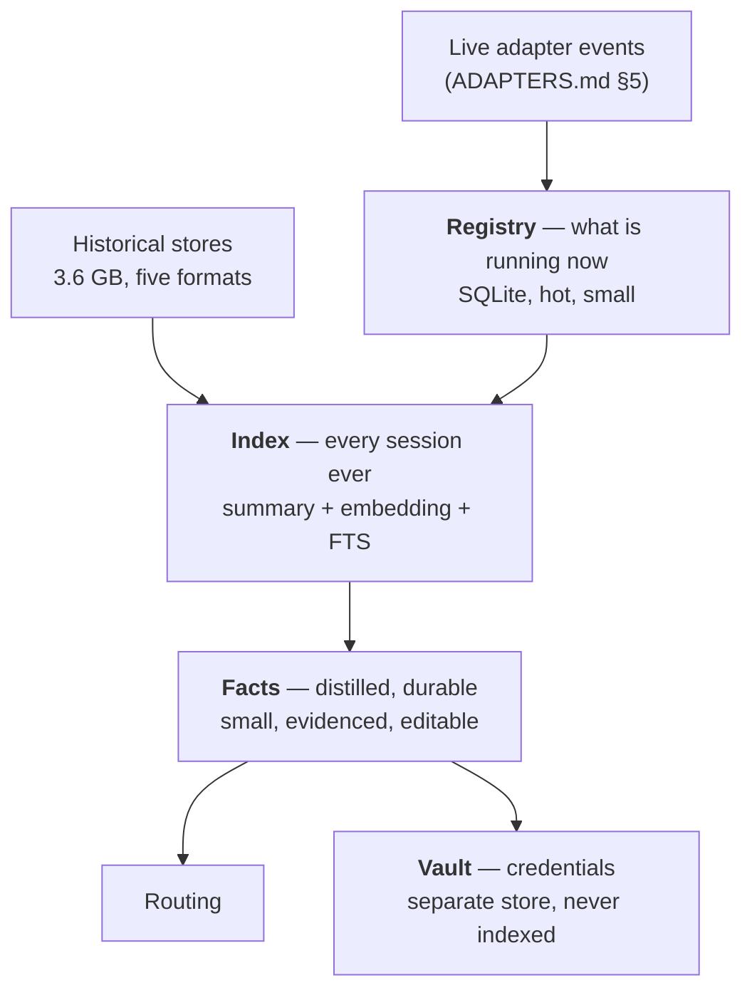

# Memory, credentials, and routing

*How the orchestrator turns five session stores into one memory, what it learns
from them, where secrets live, and how it decides which runtime gets the work.
Companion to `ADAPTERS.md`, which covers driving the runtimes themselves.*

---

## 1. What is actually on a real machine

Measured on the author's Mac, 2026-08-09, before any Relay code existed:

| Runtime | On disk | Sessions |
|---|---|---|
| Hermes | **2.5 GB** | 27 sessions, 4,379 messages, SQLite + FTS5 |
| Claude Code | **786 MB** | one JSONL per session under `~/.claude/projects/<slug>/` |
| Codex | **295 MB** of sessions | `session_index.jsonl` + rollout files |
| OpenCode | 11 MB | **zero** — installed, never run |
| OpenClaw | — | **`~/.openclaw` does not exist** — installed, never run |

Three facts to design around:

**~3.6 GB of history exists before we ship anything.** The first run of the
installer is not a cold start; it is an archaeology job. That is the single best
thing about this product's first five minutes — it can know the user's stack
before they have said a word to it.

**The corpus is wildly lopsided.** One runtime is 70% of it. Any design that
assumes even distribution across five runtimes will be wrong.

**Two of five runtimes had no data at all.** "Installed but never used" and "not
installed" are the normal cases, not edge cases. The installer must not treat a
missing store as an error, and the router must not offer a runtime the user has
never once used as though it were a peer of the one they live in.

---

## 2. Three tiers, because they have different lifetimes

| Tier | Holds | Size | Lifetime |
|---|---|---|---|
| **Registry** | live sessions, status, what each is working on | KBs | minutes–days |
| **Index** | one row per session, one per turn-cluster, searchable | tens of MB | forever |
| **Facts** | "prefers Supabase", "deploys on Vercel", "uses Stripe" | KBs | forever, decaying |
| **Vault** | API keys and tokens | KBs | until rotated |

The tiers are separate because conflating them is how this goes wrong. A fact is
not a search hit — it has been distilled, checked and can be shown to the user. A
credential is not a fact — it must never appear in a search result.

---

## 3. Do not embed the transcripts

The instinct is to vectorise all 3.6 GB. **Don't.** Embed *summaries* instead —
one per session, one per turn-cluster.

| | Raw transcripts | Summaries |
|---|---|---|
| Chunks | ~875,000 | ~22,000 |
| Vectors on disk (768-dim) | ~2.7 GB | ~68 MB |
| Brute-force query | slow enough to need an ANN index | **44 ms, measured** — see Storage below |
| Precision | poor — diffs, stack traces and tool output dominate the space | high — every chunk is meaning |

The cost of embedding raw text is survivable; the *retrieval quality* is not. A
coding transcript is mostly command output and patch hunks. Embedding that buries
the two sentences that actually said what the session was for. Summarising first
is both cheaper and more accurate, which is rare enough to take.

**Keep the raw transcripts** — on disk, in place, unmoved. The index stores a
pointer (`runtime`, `session_id`, `byte_offset`) so anything can be re-read in
full on demand. We are building an index, not a copy.

### Where the vectors come from, and why the width is a one-way door

The 768 in the table above is not a sizing preference that can be revisited. It
is `store.EmbeddingDims`, and **a `vec0` column's width is fixed when the table
is created** — there is no widening and no narrowing, only a new index.
`store.ErrEmbeddingDims` refuses anything else on write, and `search.New`
refuses to build a searcher on an embedder that disagrees, so a mismatch is
caught rather than stored.

Two consequences, and both are load-bearing:

**The embedder is chosen at install, before anything is embedded.** That is
`ORCHESTRATOR.md` §2c — a step alongside the voice and the two orchestrator
models, sitting after the models and before the pairing code, because §4's
backfill runs after pairing and is what creates the index. The default is
**`nomic-embed-text` on Ollama, running on the user's own machine**, which the
installer provisions itself: 768 dimensions natively, so it matches this table
exactly. Hosted embedders are offered through the same grouped vendor list §2b
uses, and nothing hosted is natively 768 — those models are asked for a
truncated vector at request time, which works because they are trained for it
and which the probe verifies rather than assumes.

**§2c recommends local where §2a and §2b recommend hosted, and the reason is
this document's own argument.** §6 says self-hosting means your keys never leave
your hardware, and that is the pitch. The summaries in this section are a
sharper asset than the keys: ~22,000 chunks that are, by construction, the
densest description of somebody's work that exists anywhere. It is not a cost
argument — 4–5 million tokens is under a dollar once, for the whole 3.6 GB — and
it is not an install-time argument either, since embedding is minutes against
§4's hour or two of summarisation. It is only about what leaves the machine.

**The index records which model wrote it**, in an `embedding_model` meta key
written on the first embedded summary and checked on **every** search. Vectors
from two models share a space only by coincidence, and the failure mode is not
an error — it is plausible-looking nonsense at the top of every result list. So
a mismatch **degrades**: the dense half stops, the lexical half keeps working,
and the reason names both models. The way out is `relay reindex`, which drops
the vectors and rebuilds them from the summaries already on disk. That is
minutes; it does **not** re-summarise, which is the expensive part and is
already done.

**No embedder at all is a supported state**, not a broken one. Search runs
lexical-only and says so on every query. A box whose embedder is down should get
worse search, not no search — and that means the third row of §2c ("none, for
now") and a failed provisioning attempt land in exactly the same place, with a
warning naming the command that fixes it.

### Storage

**SQLite**, per `SYSTEM.md` §8's rejection of Postgres, plus two extensions:

- **`sqlite-vec`** for vectors. An extension, not a daemon — which is the whole
  reason Postgres was rejected. Benchmarked twice, and **the two numbers are ten
  times apart**, so both belong here.

  **What we ship**, and therefore the number that governs: pure-Go `sqlite-vec`
  v0.1.6 under wazero, SQLite 3.47.0, amd64, 768-dim brute force, k=10, 50
  queries, warm cache. Measured 2026-08-10 on a 4-vCPU Intel Xeon @ 2.10 GHz
  Linux container:

  | Vectors | Median kNN | Max | Insert | On disk |
  |---|---|---|---|---|
  | **22,000** (the design target) | **43.7–44.4 ms** | 53.7 ms | 7,400–8,200/s | 66.6 MB |
  | 100,000 | 187.0 ms | 241.4 ms | 7,515/s | 296.5 MB |
  | 250,000 | 451.7 ms | 515.7 ms | 7,869/s | 741.4 MB |

  The 22k row is the range over three runs; the medians landed within 0.7 ms of
  each other, the maxima did not — a shared container's tail is noise, so size
  against the median and expect an occasional 50 ms. The query measured is
  `select rowid, distance from summaries where embedding match ? and k = ?
  order by distance` against `create virtual table summaries using
  vec0(embedding float[768])`, L2-normalised random vectors, default chunk size.

  **What the earlier probe measured**, kept because it is the ceiling this design
  was originally sized against: native `sqlite-vec` v0.1.9, SQLite 3.51.1, arm64,
  same dims and same brute force:

  | Vectors | Median kNN | Max | On disk |
  |---|---|---|---|
  | 22,000 | 4.2 ms | 4.7 ms | 68 MB |
  | 100,000 | 19.4 ms | 20.1 ms | 307 MB |
  | 250,000 | 48.5 ms | 51.0 ms | 768 MB |
  | | | inserts ~58,000/s | |

  On-disk sizes agree within 4% across the two runs, which is the cross-check
  that both were doing the same work. Query latency is **~9–11× worse** and
  insert throughput ~7× worse on the build we ship. Treat 10× as an **upper bound
  on the wasm penalty, not a clean attribution**: the two runs differ in CPU
  (Xeon vs. Apple silicon), architecture, SQLite version and sqlite-vec version
  as well as in build. Nobody has run native and wasm on the same machine.

  **Why we ship the slower one.** cgo. A native `sqlite-vec` means a cgo build,
  and cgo means one toolchain per target — which destroys the single static
  binary and the one-machine cross-compile that `SYSTEM.md` §8 requires and that
  the $0 self-host tier depends on. The wasm build is pure Go via wazero and
  cross-compiles to darwin/linux × arm64/amd64 from one box. **45 ms is a
  perfectly good memory lookup** inside `SYSTEM.md` §7b's sub-second voice
  budget, and it buys the distribution story. That is the trade, made knowingly.

  **The conclusion survives, the headroom does not.** An ANN index is still not
  needed at the 22k design target. But the margin is ten times thinner than this
  document used to claim, and the old advice to "revisit past ~150k" is **wrong
  for this build** — 100k already costs 187 ms, which is felt in a spoken
  interaction, and 250k costs 452 ms, which is most of the voice budget on its
  own. **Revisit at ~50k, and treat 100k as the ceiling for brute force.** Above
  that the options are a coarse pre-filter on metadata (runtime, repo, recency)
  before the vector scan, partitioned vec0 tables, or — last — an ANN index and
  the cgo argument reopened.

  **The exact stack, and one trap that costs a day.** These are load-bearing
  pins, not a snapshot of what `go get` happened to resolve:

  | Module | Pin | Why this exact one |
  |---|---|---|
  | `github.com/asg017/sqlite-vec-go-bindings/ncruces` | v0.1.6 | embeds a SQLite wasm **with sqlite-vec compiled in** |
  | `github.com/ncruces/go-sqlite3` | **v0.21.0** | v0.35 removed `sqlite3.Binary` (compile error); v0.17.1, and v0.22 through v0.30, fail at module-instantiation time with `i32.atomic.store invalid as feature "" is disabled` — the wasm-threads feature is not enabled in those |
  | `github.com/tetratelabs/wazero` | **≥ v1.9.0** | see below. v1.12.0 requires Go ≥ 1.25 |

  > **The trap.** `go get` on the two modules above resolves wazero **v1.8.2**,
  > and on v1.8.2 *every* `vec0` table panics with
  > `wasm error: out of bounds memory access` — inside `vec0Filter` on query and
  > inside `vec0Update` → `blobReadWrite` → `accessPayload` on insert. It fails
  > on ten 4-dimensional vectors, so it is not a memory-limit problem and it is
  > not a scale problem; it is a wazero bug in the shared-memory path that
  > sqlite-vec's blob I/O walks straight into. **v1.7.3, v1.8.0 and v1.8.2 are
  > all broken; v1.9.0, v1.10.1 and v1.11.0 are all clean.** So `go.mod` must
  > carry an explicit `github.com/tetratelabs/wazero v1.9.0` (or newer) even
  > though nothing imports it directly, and a test must actually insert into a
  > `vec0` table — `select vec_version()` succeeds on the broken versions and
  > proves nothing.

  Never import `github.com/ncruces/go-sqlite3/embed`: its `init()` overwrites
  `sqlite3.Binary` with a vanilla SQLite and sqlite-vec silently disappears
  (`no such function: vec_version`).
- **FTS5** for lexical search. Hermes already runs FTS5 over its own messages at
  this scale, which is a working existence proof on the exact hardware.

**Hybrid retrieval, not pure vector.** Reciprocal-rank fusion over BM25 and
cosine. Exact identifiers — a repo name, an error string, `STRIPE_SECRET_KEY` —
are where vector search is weakest and BM25 is strongest, and those are most of
what routing actually looks up.

Fusion is on **rank, not score**, and that is not a stylistic choice: SQLite's
`bm25()` is a negative unbounded number and `vec0`'s `distance` is a positive L2
magnitude, so there is no principled normalisation between them and every
invented one drifts as the corpus grows. Rank is comparable by construction.
`k = 60`, from the original RRF paper.

### Two retrievers were not enough — found while building it

The two-list design **fails the exact-identifier case it exists for**, and it
fails it narrowly enough that it would have shipped. Measured on the corpus in
`relayd/internal/search`: query `STRIPE_SECRET_KEY`; one summary contains the
literal identifier, another is a paraphrase about billing credentials that
happens to contain the word "key". BM25 ranks the identifier 1st and the
paraphrase 2nd; cosine ranks the paraphrase 1st and the identifier 4th. Plain
RRF scores them 0.03202 and 0.03252 — **the paraphrase wins**, because being 2nd
and 1st beats being 1st and 4th. Weighting BM25 up by 3× still left the exact
match a hair behind, and a weight is a global thumb on the scale that would
degrade descriptive queries to buy this one.

So there is a **third retriever, and it only runs when the query names
something**: an FTS5 phrase query over the identifiers in the query, AND'ed,
returning only documents that contain all of them. It is evidence about a
document rather than a thumb on the scale — either the summary contains
`STRIPE_SECRET_KEY` or it does not — and it wins the same case by ~50%. A query
with no identifier in it (*"which session was the payments thing"*) runs two
lists as before; AND-ing ordinary words together is a precision trap, not a
signal.

"Names something" is three mechanical tests: a compound identifier
(`STRIPE_SECRET_KEY`, `api.stripe.com`, `relay/relayd`), a token mixing letters
and digits (`sqlite3`, `v0.21.0`), or a shouted acronym (`ECONNREFUSED`,
`SIGSEGV`) — the last suppressed when the whole query is upper case, because a
caps-lock key is not fourteen identifiers.

Two smaller things the implementation settled:

- **The index tokenizer is `porter unicode61`, which splits `STRIPE_SECRET_KEY`
  into three tokens and keeps nothing whole.** So an identifier is queried as
  the phrase `"stripe secret key"` — adjacent and in order, which is as close to
  exact as the tokenizer allows — *and* as its parts, OR'd, so a summary saying
  "the Stripe key" is still found.
- **The dense half cannot be pre-filtered.** `summary_vec` is a `vec0` table with
  one column and no metadata, so a filter on runtime, workspace or date is
  applied *after* the kNN and the candidate depth has to be over-fetched to
  survive it. That is also the shape of the pre-filter escape hatch above: it
  needs metadata columns on the vector table, which is a migration.

**The kNN is not the whole lookup.** The 45 ms above is `vec0` in isolation;
the budget in `SYSTEM.md` §7b is for a memory lookup end to end. Measured
2026-08-10 on the same 4-vCPU Xeon container, `BenchmarkHybridSearch` in
`relayd/internal/search` — full path, both FTS5 queries, the kNN, the hydration
join and a local embedder: **20.8 ms at 5,000 vectors**, of which roughly half
is the kNN. The non-kNN half is near enough constant, so the 22,000-vector
design target lands around **55–60 ms end to end** — still comfortably inside
the budget, and still worth knowing, because "45 ms" is the floor rather than
the figure.

The term that is *not* in that measurement, and that dominates it for a hosted
provider, is **embedding the query**: one network round trip before the kNN can
start. A local embedder makes it free; a remote one makes it the largest single
cost in a memory lookup. That is a reason to prefer a local embedding model on a
self-hosted box, independently of price.

**A model swap under a populated index is silent corruption**, so the index
records which embedding model wrote its vectors and every search checks it. A
mismatch **degrades** — the dense half stops, the lexical half answers, and the
reason names both models — because the alternatives are refusing to start, which
bricks the box, and mixing two vector spaces, which is wrong and invisible. The
way out is a re-embed, and it is a first-class flow rather than an error message.

---

## 4. Ingestion

### Backfill, once, at install

One reader per store. Three of the five formats are already structured well
enough that this is parsing, not scraping:

| Runtime | Source | Free metadata |
|---|---|---|
| Claude Code | `~/.claude/projects/<slug>/<uuid>.jsonl` | `cwd`, `gitBranch`, `timestamp`, `version`, **`aiTitle`** — it titles its own sessions |
| Hermes | `~/.hermes/state.db` | `title`, `cwd`, `model`, `started_at`, `message_count`, `tool_call_count`, `estimated_cost_usd`, `actual_cost_usd` |
| Codex | `~/.codex/sessions/YYYY/MM/DD/rollout-<iso>-<uuid>.jsonl`, indexed by `~/.codex/session_index.jsonl` | **probed**: `session_meta.payload` gives `cwd`, `git`, `id`, `model_provider`, `cli_version`, `instructions`, `originator`, `source` |
| OpenCode | `opencode export <id>` | JSON, and **`--sanitize` redacts secrets and file data** |
| OpenClaw | `<state>/agents/<agent>/sessions/sessions.json`, plus transcripts | **the state dir is relocatable** — see below |

**Codex rollout format, probed** (133 rollouts on the test machine). Four line
types, each `{type, timestamp, payload}`:

| Line type | `payload.type` values | Use |
|---|---|---|
| `session_meta` | — | `cwd`, `git`, `id`, `model_provider` — free metadata, once per file |
| `response_item` | `message`, `function_call`, `function_call_output`, `reasoning`, `ghost_snapshot` | the turns |
| `event_msg` | `user_message`, `agent_reasoning`, **`token_count`** | so Codex *does* carry cost data for backfill |
| `turn_context` | — | per-turn settings |

**Never hardcode `~/.openclaw`.** Its state directory moves: `OPENCLAW_STATE_DIR`,
`--profile <name>` (→ `~/.openclaw-<name>`) and `--dev` (→ `~/.openclaw-dev`) all
relocate it, and the session store path is itself configurable in the gateway
config. Resolve it by asking — `openclaw config file` prints the config path — and
a reader that assumes the default will silently find nothing and report an empty
history as success. The directory also does not exist until the gateway has run
at least once, which is the §1 "installed but never used" case in the flesh.

Two things worth stealing rather than rebuilding: Claude Code and Hermes both
already generate session titles, so the summariser's first job is done for a
large share of the corpus. And `opencode export --sanitize` is a redaction
primitive that exists — §6 needs exactly that behaviour everywhere.

Backfill is **incremental and resumable**, keyed on `(runtime, session_id,
mtime)`. 3.6 GB summarised through a small model is an hour or two of work, and
it must survive being interrupted. It also runs *after* the pairing code prints —
nobody should watch a progress bar before their glasses work.

**What `mtime` means differs by store, and getting it wrong re-indexes
everything — found while building the readers.** For Claude Code and Codex one
file is one session, so the key is that file's mtime and size. For Hermes and
OpenClaw one file holds *every* session, so the file's mtime moves whenever any
session does: keying on it would re-read all 27 Hermes sessions on every run and
the resume would be worthless. Those readers key on the **session's own
last-activity column** and its message count instead, and every ref records
which of the two it used (`Ref.MTimeFrom`) so the choice is visible rather than
implied. OpenCode has neither — its transcript arrives from a command — so it
keys on the export's own updated timestamp.

**Enumeration is not the same as export, and only export is probed.** §4's table
gives `opencode export <id>`, which reads *one* session; nothing documents how to
*list* the ids. The reader therefore tries a short list of `--json`-shaped
commands, falls back to the on-disk `storage/session/` layout, and labels both as
guesses. The distinction that matters is between "OpenCode answered and has no
sessions" — the measured case, and success — and "nothing we tried would answer",
which is reported as **unreadable, with every command we tried**, never as an
empty history. Same rule as §7's, and for the same reason: the two lead to
opposite decisions and only one of them is recoverable.

### Live

Every `TurnCompleted` from `ADAPTERS.md` §5 writes a turn summary, updates the
session row, and re-runs fact extraction against that session only.

Four rules the implementation had to add, each one a case where "write the turn
summary" is not what you want:

- **The turn summary is written from the events, not from the transcript** —
  `ADAPTERS.md` §6's first rule, applied to the index as well as to speech. A
  turn that printed forty thousand lines of test output contributes the same
  handful of facts as one that printed none, which is exactly the property that
  makes summaries worth embedding and transcripts not.
- **A replayed turn is not indexed.** ACP's `session/load` replays a whole
  conversation as `session/update` notifications before it resolves, and the
  summary insert is an insert rather than an upsert, so indexing replays writes
  a second copy of history that backfill already owns from the file on disk.
  Same reason `Meta.Replay` suppresses the ping, one tier down.
- **The same `TurnCompleted` twice is once.** A reconnect or a duplicated bus
  delivery must not double-index, so turn boundaries are idempotent per
  `(runtime, session, turn)`.
- **Secret markers have one writer per path.** During backfill the reader has
  already scanned the text off disk and written a marker per finding, so the
  summariser writes none — one credential, one marker. On the live path nothing
  else has seen the text, so the summariser writes them. Two writers with two id
  schemes would put the same credential in the table twice.

The live path also has **no transcript pointer**: the normalized event model
carries no file path, deliberately, because three of the five runtimes write
their transcripts somewhere Relay does not control. A live session can be bound
to a path when one is known; otherwise its summaries carry no pointer until
backfill fills it in, and the row says so rather than implying the session
cannot be reopened.

**Who owns the `session_index` row.** Step 2b's readers do — they know things
the summariser never sees, including which of the four title provenances a title
had. Step 2c *merges*: it supplies what it was given, keeps whatever is already
there, and never blanks a field. The two steps can therefore run in either order
without one erasing the other, which matters because backfill and the live
stream both reach the same row.

---

## 5. Facts — the part that earns its keep

The distilled layer: *"prefers Supabase over Firebase"*, *"deploys on Vercel"*,
*"uses Stripe for payments, Twilio for SMS"*, *"writes Go for daemons, TypeScript
for anything with a UI"*.

This is what makes the product feel like it knows you, and it is also the layer
most likely to be confidently wrong. Five rules keep it honest.

**Every fact carries evidence.** Source sessions, with dates. A fact that cannot
point at where it came from is deleted, not kept at low confidence.

**Facts decay.** A preference from 2024 that has not recurred is weaker than one
from last week. Decay is on *last observation*, not creation — a long-held habit
that still shows up stays strong.

**Contradictions replace, they do not accumulate.** Someone who moved from
Firebase to Supabase has one preference and one piece of history, not two active
preferences. When new evidence contradicts an old fact, the old one is
superseded and kept as history with its date, so "you used to use Firebase" is
still answerable.

**Facts are visible and editable.** One screen, in the app and the dashboard,
listing everything inferred with its evidence and a delete button. This is not a
nicety — an unexamined inference store poisons every routing decision downstream,
silently, forever. The screen is what makes the whole tier defensible.

**Nothing in this tier is a secret.** Facts say *that* a service is used, never
the credential for it. "Uses Stripe" is a fact. The key is §6's problem.

---

## 6. Credentials — build it, and be careful

The ask is to keep the API keys that have appeared over time so the agents can
use them. That is genuinely useful and genuinely the most dangerous thing in this
document, so the design states the risks rather than burying them.

**Three ways a key arrives**, in descending order of how much we should like them:

1. **Typed into the app or the cloud dashboard.** The clean path. Explicit,
   attributed, current.
2. **Discovered in an existing config.** Runtimes already store provider
   credentials in known places — `~/.local/share/opencode/auth.json` is right
   there. Enumerable at install with the user watching.
3. **Extracted from a transcript.** The convenience path, and the one that needs
   the guardrails below.

### Rules

**The index never holds a secret.** Detection happens *before* indexing: a
candidate is matched, moved to the vault, and the indexed copy is replaced with a
marker — "a Stripe secret key appeared in this session". Search results, summaries
and embeddings all see the marker. This ordering is not negotiable, because an
embedded secret cannot be unembedded.

**Nothing is captured silently.** Detection produces a *proposal*, exactly like
the connector flow in `ORCHESTRATOR.md` §4b:

> I found what looks like a Twilio auth token in a session from March. Save it as
> your Twilio credential?

**Validate before trusting.** Same probe as the installer's model keys: one real
call. Transcript-scraped keys are frequently stale, revoked, or truncated by a
line wrap, and a silently-wrong credential is worse than a missing one.

**Newest validated wins, and provenance is kept.** Which session, what date. Two
Stripe keys means one is probably rotated; the vault should say which is which
rather than guessing.

**A key in your transcript may not be yours.** Colleagues paste keys into
pairing sessions. The confirmation step is the only thing standing between that
and us storing someone else's production credential. Say so in the proposal when
the session had another participant.

### Where the vault lives — and this differs by tier

| | Self-hosted | Relay Cloud |
|---|---|---|
| Store | OS keychain, or an encrypted file whose key is in the keychain | KMS-backed, per-customer |
| Leaves the machine | **never** | to our infrastructure |
| Blast radius | that machine | that customer's box |

This is a real purchase consideration and belongs on the pricing page, not buried
here: **self-hosting means your keys never leave your hardware.** For a chunk of
this audience that is the entire argument.

`CLOUD.md` §4's claim that "the control plane never touches user data" needs
amending — with a cloud vault it touches the most sensitive data there is. The
honest version is that the control plane never touches *transcripts*, and the
vault is per-customer, encrypted, and separately access-controlled.

---

## 7. MCP — one registry, reconciled from five

`ORCHESTRATOR.md` §4b already establishes the shared MCP bus. What is new is
that the runtimes arrive with servers already connected — `claude mcp`,
`codex mcp`, `hermes mcp`, `opencode mcp` and OpenClaw's config each hold their
own list.

So the installer **enumerates and reconciles** rather than starting empty:

1. Read every runtime's MCP config.
2. De-duplicate by command and args — the same server configured three times is
   one server.
3. Present the union: "you have 7 MCP servers across 3 tools. Manage them in one
   place?"
4. On accept, point every runtime at the Relay registry and keep the originals as
   a rollback.

Same catch as §4b: some runtimes enumerate tools once per session, so a server
added mid-session is invisible until restart. The orchestrator says which it did.

### Steps 1–3 ship before step 4 can — found while building the installer

Step 4 writes, and what it writes has to point at something real. Relay's own
MCP gateway is **step 6 of `ORCHESTRATOR.md` §6's build order**, three steps
after the installer. Rewriting five runtime configs to point at a server that
does not exist yet would take a machine with seven working MCP servers and leave
it with none — the exact "connected means nothing" failure §4b is trying to
prevent, produced by the fix for it.

So the two halves are separated, and the split is in the code
(`relayd/internal/install/mcp.go`, `MCPGateway`):

| | Ships in M1 | Ships with the gateway |
|---|---|---|
| Read all five configs, de-duplicate, present the union, ask | yes | — |
| Write Relay's own reconciled registry file | yes | — |
| Rewrite each runtime's config, back up the original, `relay mcp rollback` | **no** | yes |

While the gateway is absent the installer does the whole read, records the
answer, changes nothing on the machine, and **says so in words** rather than
appearing to have done something. The write half is implemented and tested
against fixtures behind the same switch, so turning it on is one field.

Two smaller rules the implementation added, both for the same reason — "no MCP
servers" and "we could not read this runtime's config" lead to opposite
decisions and only one of them is recoverable:

- **Only structured input.** Every source is a `--json` flag or a config file in
  JSON, TOML or YAML. A runtime that offers neither is reported as *unreadable,
  with the places we looked*, never as an empty list.
- **A runtime that answered only through its CLI is not rewritten**, because
  there is no file to restore and adoption is only defensible while it is
  reversible. The installer prints what to run instead.

---

## 8. Routing — where a new session starts

Two questions, and they are different: *new session or existing?* is
`ORCHESTRATOR.md` §4. This is the second one — **which runtime**.

### Prefer the runtime where the work is already paid for

The sharpest input is entitlement. A Claude Max subscription makes Claude Code
free at the margin; the same work through the Anthropic API costs real money, and
`ORCHESTRATOR.md` §2b already established that a Claude subscription cannot be
used any other way. So:

| The user has | Route Claude-model work to | Because |
|---|---|---|
| Claude Max / Pro | **Claude Code** | the only sanctioned client for that credential |
| ChatGPT Plus / Pro | **Codex** | Codex OAuth is the sanctioned path |
| GitHub Copilot | OpenClaw / OpenCode | both expose Copilot as a provider |
| Coding plans (Z.AI, MiniMax, Qwen, Kimi) | whichever runtime lists that provider | |
| Raw API keys only | any — pick on capability and load | |

This is not a small optimisation. For a heavy user it is the difference between a
subscription they already pay for and a metered bill they did not expect, and it
is invisible to them unless we get it right.

### Full priority order

1. **Continuity.** A live session already on this repo and topic beats a fresh
   session anywhere. Cheapest and most often correct.
2. **Explicit preference.** Stated ("use OpenCode for this") or learned from §5
   ("always uses Codex for Rust").
3. **Entitlement.** The table above.
4. **Capability.** Does that runtime have the MCP server or connector this needs?
5. **Load.** Is it already mid-turn, and can it be steered (`ADAPTERS.md` §4 —
   three of five cannot)?

**Never route to a runtime with no history and no explicit preference.** §1 found
two installed-but-unused runtimes on a real machine. Sending someone's first
voice command to the tool they have never opened is a bad first impression
dressed up as load balancing.

### The same guardrails as §4

Announce the choice — *"starting a new Codex session on the API repo"* — allow
undo, and ship the manual override first. A router that is right 80% of the time
and silent about it is worse than one that asks.

### Three things building `internal/routing` settled

**An entitlement is declared, never inferred.** A Claude Code binary on `PATH`
is not evidence of a Claude Max plan, and a runtime being installed says nothing
about which credential is behind it. So the entitlement set starts empty, the
installer or the console records what the user says they have, and an empty set
skips step 3 with a note rather than guessing. Guessing here produces exactly
the failure this section exists to prevent — a metered bill nobody expected —
and it produces it silently.

**The coding-plan row is a lookup, and the lookup has holes.** "Whichever
runtime lists that provider" is not a constant, and we have only read one of the
five vendors' lists: `ORCHESTRATOR.md` §2b recorded Z.AI, MiniMax, Qwen and
Chutes in OpenClaw's own auth-choice file. Kimi is not among them, and no
OpenCode or Hermes provider list has been read at all. Those cells are
`SupportUnknown` — the same three-way answer the adapter capability descriptor
uses — and the router will not spend a subscription on one. An unknown cell
stays a candidate for capability and load and is reported with the probe that
would close it, which is the `ADAPTERS.md` §8 discipline applied to entitlement.

**"No history" includes "nobody looked".** The never-route rule has to cover the
runtime whose store was never opened, not just the one that was opened and found
empty — a store nobody checked reported as used is the same class of lie as an
adapter emitting an event it did not observe. §1's own measurement is why:
`~/.openclaw` did not exist on the machine, so *unknown* and *empty* were both
present, on the same afternoon, and only one of them was ever checked.

---

## 9. Context — when to compact, and when to start over

Routing decides where work goes. This decides when that session is used up. The
orchestrator owns it because **the runtimes each solve it alone and blindly**,
and we are the only component that can see across all of them.

### We can already measure the pressure

Context size arrives free in the turn events from `ADAPTERS.md` §5:

| Runtime | Signal |
|---|---|
| Claude Code | the **latest `message_start`** (or `message_delta`) `usage` — `input_tokens + cache_read_input_tokens + cache_creation_input_tokens`. Denominator free from `result.modelUsage[<model>].contextWindow` |
| Codex | `thread/tokenUsage/updated` — `{last, total}` as `{inputTokens, cachedInputTokens, outputTokens, reasoningOutputTokens, totalTokens}`, plus `modelContextWindow` |
| Hermes | per-session `input_tokens` / `cache_read_tokens` in SQLite |

**Do not use Claude Code's `result.usage` for this — corrected 2026-08-10.** It
was the signal named here until the 49-event fixture was read carefully, and it
is the wrong one: `result.usage` **sums the requests a turn took**, so the
fixture's first turn (one `Bash` call, so two requests) reports 51,997 cache-read
tokens for a context that was actually ~33,500. A turn with eight tool calls
would overstate pressure eightfold and fire compaction on a nearly empty session
— the exact ten-to-sixty-second silence this section exists to prevent. Read the
**latest request's** usage instead; across the fixture that reads
33,497 → 33,609 → 33,637, which is monotonic and true. And note the asymmetry in
the same event: `result.usage` is per-turn, while `result.modelUsage` and
`total_cost_usd` are session-cumulative (`ADAPTERS.md` §2).

**A percentage needs a denominator, and Claude Code's is now free.**
`result.modelUsage[<model>].contextWindow` carries it — 1,000,000 in the fixture,
alongside `maxOutputTokens` — so no config read and no per-model table is needed
for this runtime.

**Codex's denominator is nullable.** Confirmed against
the vendored schema (`docs/fixtures/adapters/codex-methods.md` §5):
`ThreadTokenUsage.modelContextWindow` is `int64 | null`. When it is null the ~70%
rule below has nothing to be 70% *of*, so the adapter needs a fallback — the
model's published window from `model/list`, or an installer-time default per
model — and must degrade to "compact on idle after N turns" rather than silently
never compacting. The same caution applies wherever a runtime reports tokens
without reporting the window.

### And we can control the timing

Every runtime exposes compaction rather than hiding it. Probed across all five:

| Runtime | Trigger on-demand | Threshold setting | Fires at |
|---|---|---|---|
| Claude Code | `/compact` as a user message — works in `--print` / stream-json | `--autocompact <auto\|100k–1M>`, `autoCompactWindow` | ~95% |
| Codex | `thread/compact/start {threadId}`, plus `preCompact` / `postCompact` | `model_auto_compact_token_limit` in `config.toml` | ~95% (258k under a 272k wall) |
| OpenCode | `POST /session/{id}/summarize` on `opencode serve` | `compaction.reserved` | ~limit − 20k |
| Hermes | `/compress` | `compression.threshold` — **default 0.50** | **50%** |
| OpenClaw | `/compact` | `agents.defaults.compaction.reserveTokens` | ~limit − 20k |

Hermes's `compression_locks` table (`session_id`, `holder`, `expires_at`) is a
lease, so its compression must be coordinated rather than raced — it has
dedicated concurrency tests upstream, which is a good sign that the contention is
real.

### Three outcomes, not two

| | When | Cost of getting it wrong |
|---|---|---|
| **Compact** | same work continuing, the history still matters | a long refactor loses the reasoning behind its own decisions |
| **New session** | the topic changed | compaction drags irrelevant context forward, and you pay for it on every turn thereafter, forever |
| **Handoff** | the work continues but the session is exhausted | — |

**Handoff is the one only we can do.** A runtime compacting summarises its own
transcript with no idea what mattered. We have the index (§3) and the facts (§5),
so we can start a genuinely fresh session and seed it with a short brief —
what the work is, what was decided, which files, which facts apply. That brief is
usually *smaller and better targeted* than the runtime's own compaction, because
it was written by something that could see what the user actually came back to.

### Signals for compact-versus-new

Reuse the machinery that already exists rather than inventing a classifier:

- **Topic drift** — cosine distance between recent turn summaries and the session
  summary. The same embeddings §3 already computes.
- **Working directory or repo change** — cheap, and strongly predictive.
- **Time gap** — a session resumed after three days is usually a new topic
  wearing an old session's name.
- **The user said so** — "new session" is already an escape hatch in
  `ORCHESTRATOR.md` §4.

### The voice-specific trap

**Compaction is ten to sixty seconds of silence.** Fired at the threshold, it
fires mid-conversation, and the user hears nothing after speaking. On a screen
that is a progress bar. In your ear it is a broken product.

So the policy inverts the usual one:

1. **Compact on idle, at ~70%, not on demand at 95%.** A session that is nearly
   full when you next speak to it has already lost — the tidying has to happen
   while nobody is listening.
2. **Leave every runtime's own auto-compaction switched on.** An earlier draft
   here said to take the decision away from them. Probing showed that is the
   dangerous move — see below.
3. **If it must happen mid-turn, say so.** The small model narrates it —
   *"give me a second, I'm tidying its memory"* — which is §3b's rule applied to
   an event the user would otherwise experience as a fault.

Idle compaction is also free in wall-clock terms, which is the rare case where
the careful thing and the fast thing are the same thing.

### Do not disable auto-compaction — probed

Four of the five runtimes already fire at ~95–100% of the window. **If Relay
compacts at 70% during idle, their own trigger simply never runs**, so leaving it
enabled costs nothing and buys a free safety net for the case where our idle pass
did not happen — the machine was asleep, `relayd` was restarting, the user talked
for an hour straight.

Disabling it is what breaks things, and in two runtimes the failure is explicit
in the source:

- **OpenCode** — with `compaction.auto: false`, a context overflow sets
  `finish: "error"` and idles the session. With it true, the overflow is caught,
  compacted reactively, and the turn continues.
- **Hermes** — all three overflow paths are guarded by `compression_enabled` and
  return `compaction_disabled: true` on failure. Its own config comment says the
  quiet part out loud: set it false if you *"want errors on overflow"*.
- **Claude Code** — degrades gracefully in three layers: a summary precomputed in
  the background at the threshold, reactive compaction when the API returns
  `prompt_too_long`, and a hard input block at `window − 3000`.
- **OpenClaw** — recovers on overflow independently of the threshold.

**Codex is the one to be careful with**, and it is the exception that matters:
`ContextWindowExceeded` is a distinct terminal error — *"Codex ran out of room in
the model's context window. Start a new thread…"* — separate from the compaction
trigger. **Never raise `model_auto_compact_token_limit` to or above
`model_context_window`.** That is the single configuration in this survey that
provably converts a graceful pause into a lost thread.

**The one change actually required is Hermes**, which defaults to compressing at
**50%** — early enough to fight our 70% pass constantly. Raise
`compression.threshold` to ~0.90 and leave `enabled: true`. Optionally lower
OpenCode's `compaction.reserved` and OpenClaw's `reserveTokens` if their defaults
prove too eager in practice.

### Precedent worth stealing

OpenClaw already ships the exact pattern this section describes:
`agents.defaults.compaction.memoryFlush` runs a **silent agent turn** at a soft
threshold below the compaction threshold, using a `NO_REPLY` convention so the
user never sees it. That is "do expensive work during idle without the user
noticing", already built and in production somewhere. Read it before writing ours.

---

## 10. Entering keys from the app or dashboard

Both write to the same vault; they differ only in reachability.

- **Phone app** — the common path. Paste, scan a QR, or hand off from a password
  manager. Works with no machine open, which is the point of the product.
- **Cloud dashboard** — for cloud-tier customers whose box has no screen, and for
  anything awkward to type on a phone.
- **Self-hosters get the app path only**, plus the CLI. There is no dashboard,
  because there is no server of ours in the loop and adding one would break the
  claim in §6 that keys never leave their hardware.

Every path ends the same way: validate with a real call, store in the vault,
record provenance, and make it available to every runtime through the §7
registry rather than to whichever agent happened to be running.

---

## 11. Build order for this document

Slots into `SYSTEM.md` §10 between steps 2 and 5:

| | Ships | Proves |
|---|---|---|
| 2b | Backfill readers + session index (no embeddings) | it knows what you have been working on |
| 2c | Summaries + hybrid search | "which session was the payments thing" works |
| 3b | Runtime routing with the entitlement table | it stops spending money you did not mean to spend |
| 5b | Fact extraction + the review screen | it knows your stack |
| 6b | Vault + key proposals | agents can act without you fetching keys |
| 6c | Idle compaction + handoff briefs | long-running sessions stop dying mid-sentence |

**2b before anything vectorised.** A plain indexed list of every session with its
title, repo and date is most of the value, ships in days, and makes the
summariser's output verifiable against something.

**But the embedding *decision* moves earlier than the embedding *work*, and that
is the one place this order is not simply "cheapest useful thing first".** The
choice ships in step 1, the installer, as `ORCHESTRATOR.md` §2c — before 2b, and
two milestones before 2c does anything with a vector. It has to, because §3's
width is fixed when the index is created and the index is created by 2b's
backfill. Asking at 2c would mean asking after the table exists, which is the
one moment the answer can no longer be acted on without a rebuild.

The cost of that is small and worth naming: a box set up during step 1 may carry
a configured embedder for weeks before anything embeds. `relay doctor` therefore
reports "configured, nothing embedded yet" as a normal state rather than a
fault, and 2b writes the `embedding_model` meta key on the first embedded
summary rather than at install — the index claims a model when it has a vector
from it, never before.

**2b has shipped** — `relayd/internal/backfill` (one reader per store) and
`relayd/internal/index` (the row, the detector, the markers). No embeddings, no
summaries, no model call anywhere in it, which is what §11 asked for. It is
schema-verified against fixtures and **not** corpus-verified against the 3.6 GB;
§12.7 records exactly what that does and does not prove. Two of the five readers
found what the §1 measurement predicted they would find on a real machine:
nothing at all, reported as success.

---

## 12. Unverified

**Every item carries a disposition** — resolved with evidence, blocked on the
author's Mac with the specific probe named, or blocked on upstream. Nothing here
is merely listed. Last dispositioned 2026-08-10.

### 12.1 Summarisation cost over 3.6 GB — NEEDS THE MAC

Estimated at an hour or two on a small model. Still not measured, and it is the
install's longest step, so the estimate is load-bearing for the first-run
experience.

**Cannot be closed in a cloud sandbox**, and not for the usual reason: the 3.6 GB
is `~/.claude/projects`, `~/.hermes` and `~/.codex` on the author's machine —
personal transcripts that must never enter this repo, so there is nothing to
measure against here. Synthetic text would measure the model's throughput, which
we already know, rather than the corpus's shape, which is the actual unknown.

**The probe, when the Mac is available:** run the §4 backfill readers over the
real stores with summarisation *disabled*, and record (a) session count, (b)
turn-cluster count, (c) total characters fed to the summariser. Those three
numbers plus a measured tokens-per-second turn the estimate into arithmetic.
Until then the installer must show a progress count and a running ETA rather
than a fixed promise, and must be resumable — an hour-long step that cannot be
interrupted is a worse bug than an hour-long step.

### 12.2 Secret detection recall — RESOLVED, and worse than the guess

**Measured 2026-08-10** against `relayd/testdata/secrets/` — 127 records, 85
synthetic credentials across 26 kinds and 42 hard negatives across 15 kinds,
scored on Go's RE2 engine, which is the engine the shipping detector uses. Every
credential in that corpus is synthetic; see its README.

| Ruleset | Recall | False positives | Precision |
|---|---|---|---|
| **Tier 1 — vendor prefixes only** | **70.6%** (60/85) | **2.4%** (1/42) | 98.4% |
| Tier 1 + tier 2 shape heuristics | 92.9% (79/85) | **26.2%** (11/42) | 87.8% |

The old text guessed "assume it misses some". It misses **three in ten**, and the
misses are not random — they are entire categories:

| Missed by tier 1 | Why |
|---|---|
| Twilio auth tokens, app secrets | bare 32- and 64-char hex; no prefix exists to match |
| opaque bearer tokens | 43 random base64 chars behind an `Authorization:` header |
| passwords inside `postgres://user:pw@host` and basic-auth URLs | the credential is a URL component |
| `SESSION_SIGNING_SECRET = "…"` | generic assignment, no vendor shape |
| a password written in a YAML var file | ordinary string, ordinary length |

Tier 2 recovers all of those and costs a 26% false-positive rate — and the false
positives are *unavoidable*, not tunable: a Twilio auth token and an MD5 digest
are both exactly 32 lowercase hex characters, and an app secret and a SHA-256
digest are both exactly 64. In the corpus, every `sha256sum` line, every OCI
image digest and every MD5 was flagged. There is no rule that separates them,
because there is no difference to separate.

**What this means for the design, and it changes §6:**

1. **Tier 1 is the auto-path. Tier 2 is redaction-only.** A tier-1 hit may be
   proposed to the vault. A tier-2 hit gets the text redacted before indexing but
   **must never auto-create a vault entry** — one in four would be a checksum.
2. **Redaction is cheap; a vault proposal is not.** Replacing a 64-hex string
   with a marker when it turns out to be a digest costs one lost search term.
   Proposing it as a credential costs the user's trust in every later proposal.
3. **§6's "detect before indexing" rule stands and is now quantified.** Running
   tier 1 alone would embed roughly 30% of the credentials in a transcript. Both
   tiers run before indexing; only tier 1 feeds the vault flow.
4. **The index is still not the security boundary.** 92.9% is not 100%.

Six positives are missed by *both* tiers, and they were written deliberately to
be: a base64-encoded key in an `echo … | base64 -d` pipeline, a hex-encoded key
fragment, a credential in a JSON field called `value`, a password stated in
prose ("the staging admin password is …"), and a Stripe key broken across a
terminal line wrap. **No regex closes these**, and it is worth saying plainly
that they are the reason a detector is a mitigation rather than a guarantee.
(Line-wrapped keys are the one class worth a targeted fix later: §6 already notes
that transcript-scraped keys are "frequently … truncated by a line wrap", so
joining wrapped continuation lines before matching is a real improvement, not a
heuristic.)

**Honest limits of this number.** The corpus and the ruleset were written by the
same author in the same sitting, which inflates any recall figure measured across
them; the `adversarial_*` kinds exist to push back on exactly that, and they are
why tier 2 scores 92.9% rather than the 100% it scored before they were added.
127 records gives roughly ±1% resolution per item, so read these as one
significant figure. Re-measure against real (never-committed) transcripts on the
Mac when 12.1 runs — that is the only sample that is not ours.

The one tier-1 false positive is a documentation placeholder,
`OPENAI_API_KEY=sk-xxxxxxxx…`, which is the correct thing to be wrong about.

### 12.3 Codex's `ContextWindowExceeded`, empirically — NEEDS THE MAC

§9's verdict rests on the error variants and messages in Codex's source rather
than an executed test — the probe machine's configured model was rejected by the
installed CLI before it reached a context decision. The evidence is strong; it is
not a run.

**The probe:** a Codex install authenticated with a model the CLI accepts, driven
past its context limit through `codex app-server`, watching for the error variant
and for whether `thread/tokenUsage/updated` keeps reporting after it. Cannot be
done from a container — the runtime must be installed *and* authenticated with
the user's own subscription, and a device-code flow on an invisible container
does not complete.

### 12.4 Claude Code with `autoCompactEnabled: false` — NEEDS THE MAC

The disable gate was traced only to the window-resolution path, so whether the
reactive `prompt_too_long` recovery survives it is unproven. **Standing advice
unchanged: raise the window, do not disable it** — which is also §9's conclusion,
so this item does not block anything.

The 49-event fixture cannot settle it: it is a two-turn session nowhere near a
context limit, and neither `system/init` nor `result` reports an autocompact
setting at all. What the fixture *did* add is the denominator — `result` carries
`modelUsage[<model>].contextWindow`, so Claude Code's context pressure is
computable per turn without any config read (see `ADAPTERS.md` §2). **The probe:**
a long session on the Mac with `autoCompactEnabled: false`, driven to the wall,
checking whether `prompt_too_long` still recovers or the turn simply fails.

### 12.5 Hermes compaction concurrency — NEEDS THE MAC

Its `compression_locks` lease (`session_id`, `holder`, `expires_at`) has dedicated
upstream tests, which implies real contention. Unchanged and unresolvable here:
Hermes is not installed in the sandbox and its 2.5 GB store is on the author's
machine.

**The probe:** read those upstream tests to learn the lease's acquire/renew/expire
semantics, then trigger `/compress` externally on a session Hermes is also
compressing and confirm Relay waits rather than races. Until that is done, the
adapter must **take the lease** before compacting and back off if it is held —
never compact optimistically.

### 12.6 sqlite-vec on the shipping stack — RESOLVED

Was implicit rather than listed, and it mattered: §3's 4.2 ms figure was measured
on a native `sqlite-vec` build that Relay does not ship. Re-measured 2026-08-10
on the pure-Go wasm build that it does. **~10× slower**, the ANN-free conclusion
survives, the headroom does not, and `wazero` must be pinned to ≥ v1.9.0 or every
`vec0` table panics. Full numbers, pins and the trap are in §3.

### 12.7 The backfill readers — SCHEMA-VERIFIED, NOT CORPUS-VERIFIED

All five readers exist and are tested (`relayd/internal/backfill`,
`relayd/internal/index`). **Every one of them was written against the schemas in
§4 and tested against synthetic fixtures at `relayd/testdata/backfill/`, and not
one of them has ever read a real store.** That is a real limit and it is stated
here rather than implied by a green test run.

Why it cannot be closed in a cloud sandbox is the same reason as §12.1, and it is
not squeamishness: the 3.6 GB is personal transcript data on the author's Mac,
and it must never enter this repo. There is nothing here to read. `~/.claude` in
a container belongs to the harness and is off limits; `~/.codex`, `~/.hermes` and
`~/.openclaw` do not exist in one at all.

So what *is* proven, and what is not:

| Proven by the fixtures | Not proven by anything |
|---|---|
| the readers parse the documented schema, including the shapes §4 names | that the documented schema is what the five runtimes write **today** |
| an absent store is success with zero sessions; an unreadable one is never reported as empty | which of the two a real machine actually produces for OpenCode and OpenClaw |
| resume across an interruption, and a second run that does no work | how long a real 3.6 GB pass takes (that is §12.1) |
| Hermes is opened read-only and its `compression_locks` lease is untouched | the lease's acquire/renew/expire semantics under contention (that is §12.5) |
| secrets are detected before indexing, and the credential never reaches the database | recall against real transcripts rather than the synthetic corpus (§12.2) |

Two schema claims are weaker than the rest and should be the first things checked
on the Mac. **`aiTitle`'s carrier** — §4 lists it as free metadata in the
per-session JSONL, but which record type carries it has not been observed, so the
reader accepts it on any line and falls back to a `summary` record and then to
the first user message, recording which happened. And **Hermes's full schema** —
only the columns §4 names are known, so the reader introspects `sqlite_master`
and `pragma_table_info` and leaves absent fields nil rather than guessing.

**The probe, when the Mac is available:** run the readers over the real stores
with summarisation disabled (which is also §12.1's probe), and check three
things — that every session in each store produced a row, that no reader reported
`unreadable`, and that the fields §4 promises were actually present rather than
filled by a fallback. The readers already carry the fallbacks in their notes, so
that third check is reading the notes rather than writing new code.

Until that has run, the BUILD-PROMPT checklist row "Index every session ever"
stays **unticked**. Code that parses a documented format is not the same as code
that has read the corpus, and this document does not pretend otherwise.
